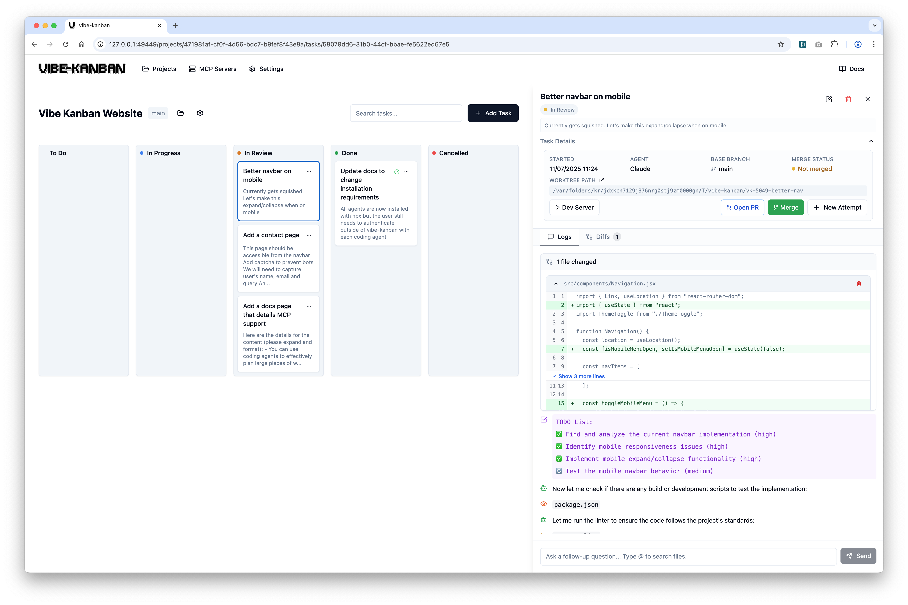

<p align="center">
  <a href="https://vibekanban.com">
    <picture>
      <source srcset="frontend/public/vibe-kanban-logo-dark.svg" media="(prefers-color-scheme: dark)">
      <source srcset="frontend/public/vibe-kanban-logo.svg" media="(prefers-color-scheme: light)">
      
    </picture>
  </a>
</p>

<p align="center">Get 10X more out of Claude Code, Gemini CLI, Codex, Amp and other coding agents...</p>
<p align="center">
  <a href="https://www.npmjs.com/package/vibe-kanban"></a>
  <a href="https://github.com/BloopAI/vibe-kanban/blob/main/.github/workflows/publish.yml"></a>
</p>



## Overview

AI coding agents are increasingly writing the world's code and human engineers now spend the majority of their time planning, reviewing, and orchestrating tasks. Vibe Kanban streamlines this process, enabling you to:

- Easily switch between different coding agents
- Orchestrate the execution of multiple coding agents in parallel or in sequence
- Quickly review work and start dev servers
- Track the status of tasks that your coding agents are working on
- Centralise configuration of coding agent MCP configs

You can watch a video overview [here](https://youtu.be/TFT3KnZOOAk).

## Installation

Make sure you have authenticated with your favourite coding agent. A full list of supported coding agents can be found in the [docs](https://vibekanban.com/). Then in your terminal run:

```bash
npx vibe-kanban
```

## Documentation

Please head to the [website](https://vibekanban.com) for the latest documentation and user guides.

## Support

Please open an issue on this repo if you find any bugs or have any feature requests.

## Contributing

We would prefer that ideas and changes are raised with the core team via GitHub issues, where we can discuss implementation details and alignment with the existing roadmap. Please do not open PRs without first discussing your proposal with the team.

## Development

### Prerequisites

- [Rust](https://rustup.rs/) (latest stable)
- [Node.js](https://nodejs.org/) (>=18)
- [pnpm](https://pnpm.io/) (>=8)

```bash
pnpm i
```

### Running the dev server

```bash
pnpm run dev
```

This will start the frontend and backend with live reloading. A blank DB will be copied from the `dev_assets_seed` folder.

### Build from source

1. Run `build-npm-package.sh`
2. In the `npx-cli` folder run `npm pack`
3. You can run your build with `npx [GENERATED FILE].tgz`


### Environment Variables

The following environment variables can be configured at build time or runtime:

| Variable | Type | Default | Description |
|----------|------|---------|-------------|
| `GITHUB_CLIENT_ID` | Build-time | `Ov23li9bxz3kKfPOIsGm` | GitHub OAuth app client ID for authentication |
| `POSTHOG_API_KEY` | Build-time | Empty | PostHog analytics API key (disables analytics if empty) |
| `POSTHOG_API_ENDPOINT` | Build-time | Empty | PostHog analytics endpoint (disables analytics if empty) |
| `BACKEND_PORT` | Runtime | `0` (auto-assign) | Backend server port |
| `FRONTEND_PORT` | Runtime | `3000` | Frontend development server port |
| `DISABLE_WORKTREE_ORPHAN_CLEANUP` | Runtime | Not set | Disable git worktree cleanup (for debugging) |

**Build-time variables** must be set when running `pnpm run build`. **Runtime variables** are read when the application starts.

#### Custom GitHub OAuth App (Optional)

By default, Vibe Kanban uses Bloop AI's GitHub OAuth app for authentication. To use your own GitHub app for self-hosting or custom branding:

1. Create a GitHub OAuth App at [GitHub Developer Settings](https://github.com/settings/developers)
2. Enable "Device Flow" in the app settings
3. Set scopes to include `user:email,repo`
4. Build with your client ID:
   ```bash
   GITHUB_CLIENT_ID=your_client_id_here pnpm run build
   ```